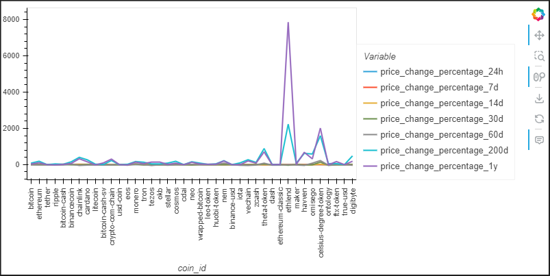

# Module 19: CryptoClustering

## The Task
Use your knowledge of Python and unsupervised learning to predict if cryptocurrencies are affected by 24-hour or 7-day price changes.

## User Story
```md
AS A data analyst
I WANT to examine cryptocurrency data
SO THAT I can understand and predict price changes.
```

## Acceptance Criteria
```md
Find the Best Value for k by Using the Scaled DataFrame
  * Code the elbow method algorithm to find the best value for k. Use a range from 1 to 11.
  * To visually identify the optimal value for k, plot a line chart of all the inertia values computed with the different values of k.
  * Answer the following question: What's the best value for k?

Cluster the Cryptocurrencies with K-Means by Using the Scaled DataFrame
  * Initialize the K-means model with best value for k.
  * Fit the K-means model by using the scaled DataFrame.
  * Predict the clusters for grouping the cryptocurrencies by using the scaled DataFrame. Review the resulting array of cluster values.
  * Create a copy of the scaled DataFrame, and then add a new column of the predicted clusters.
  * Using hvPlot, create a scatter plot by setting x="price_change_percentage_24h" and y="price_change_percentage_7d". Color the graph points with the labels that you found by using K-means. Then add the crypto name to the hover_cols parameter to identify the cryptocurrency that each data point represents

Optimize the Clusters with Principal Component Analysis
  * Create a PCA model instance, and set n_components=3.
  * Use the PCA model to reduce the features to three principal components.
  * Get the explained variance to determine how much information can be attributed to each principal component.
  * Answer the following question: What's the total explained variance of the three principal components?
  * Create a new DataFrame from the scaled PCA data. Be sure to set the coin_id index from the original scaled DataFrame as the index for the new DataFrame. Review the first five rows of the DataFrame.

Find the Best Value for k by Using the PCA DataFrame
  * Code the elbow method algorithm, and use the scaled PCA DataFrame to find the best value for k. Use a range from 1 to 11.
  * To visually identify the optimal value for k, plot a line chart of all the inertia values computed with the different values of k.
  * Answer the following questions: What's the best value for k when using the scaled PCA DataFrame? Does it differ from the best value for k that you found by using the original scaled DataFrame?

Cluster the Cryptocurrencies with K-means by Using the PCA DataFrame
  * Initialize the K-means model with the best value for k.
  * Fit the K-means model by using the PCA data.
  * Predict the clusters for grouping the cryptocurrencies by using the PCA data. Review the resulting array of cluster values.
  * Create a copy of the scaled PCA DataFrame, and then add a new column of the predicted clusters.
  * Using hvPlot, create a scatter plot by setting x="PC1" and y="PC2". Color the graph points with the labels that you found by using K-means. Then add the crypto name to the hover_cols parameter to identify the cryptocurrency that each data point represents

Visualize and Compare the Results
  * Create a composite plot by using hvPlot and the plus sign (+) operator to compare the elbow curve that you created from the original scaled DataFrame with the one that you created from the scaled PCA DataFrame.
  * Create a composite plot by using hvPlot and the plus (+) operator to compare the cryptocurrency clusters that resulted from using the original scaled DataFrame with those that resulted from the scaled PCA DataFrame.
  * Answer the following question: Based on visually analyzing the cluster analysis results, what's the impact of using fewer features to cluster the data by using K-means?
```

## Visualizations
All cryptocurrency coins with all time variables:


### Original Scaled Data
Elbow graph to find best value for k for Original Scaled data:


Scatter graph from Original Scaled data, comparing 24-hour price changes against 7-day changes:


### Principal Component Analysis
Elbow graph to find best value for k for PCA data:


Scatter graph from PCA data, comparing PC1 against PC2:


## License
This project is licensed under the GNU General Public License v3.0.  
License Link:
https://www.gnu.org/licenses/gpl-3.0.en.html   
[](https://www.gnu.org/licenses/gpl-3.0)